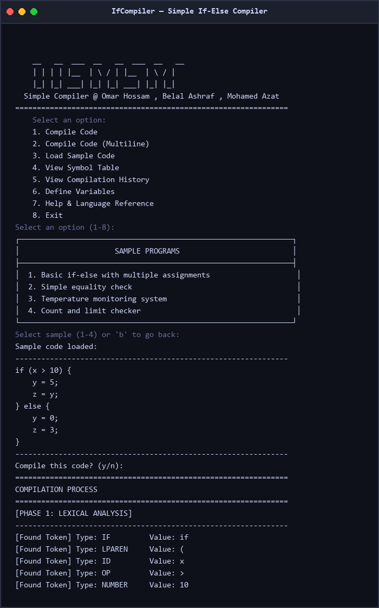
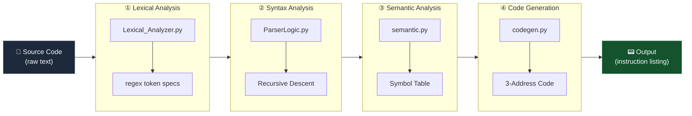

<div align="center">

# 🔧 IfCompiler

### *A complete, educational compilation pipeline for if-else statements — built in pure Python.*

<br/>

[](https://www.python.org/)
[](https://opensource.org/licenses/MIT)
[]()
[](https://aast.edu)

<br/>

> Built as a System Programming / Compiler Design project at the  
> **Arab Academy for Science, Technology & Maritime Transport (AAST)**

</div>

---

## 📸 Preview

<div align="center">



*The interactive terminal UI showing the 8-option compiler menu*

</div>

---

## 📖 About

**IfCompiler** is a fully self-contained, educational compiler written in pure Python that demonstrates a complete 4-phase compilation pipeline — from raw source text all the way down to 3-address machine-level code. It targets a minimal but expressive language supporting integer variables, assignment statements, comparison operators, and `if-else` conditional blocks. The project ships with an interactive terminal UI that lets you compile code, inspect the symbol table, replay history, and explore built-in samples — all without installing a single external dependency.

---

## ✨ Features

| Feature | Description |
|---|---|
| 🔡 **Lexical Analysis** | Regex-powered tokenizer that classifies 11 distinct token types |
| 🌲 **AST Generation** | Recursive descent parser that produces a clean Abstract Syntax Tree |
| 🔍 **Semantic Analysis** | Symbol table with undeclared-variable detection and type checking |
| ⚙️ **Code Generation** | Accumulator-style 3-address code with labels, jumps, and temporaries |
| 🖥️ **Interactive TUI** | 8-option menu-driven CLI with session history and multi-sample loader |
| 📦 **Zero Dependencies** | Runs on any Python 3.8+ installation — no pip install needed |
| 🧪 **Built-in Samples** | 4 pre-loaded example programs for instant exploration |
| 📋 **Session History** | View and replay every compilation performed in the current session |

---

## 🚀 Compilation Pipeline

IfCompiler processes source code through four sequential phases:



### Phase Details

| # | Phase | Module | Output |
|---|---|---|---|
| 1 | **Lexical Analysis** | `Lexical_Analyzer.py` | Token stream (type + value pairs) |
| 2 | **Syntax Analysis** | `ParserLogic.py` | Abstract Syntax Tree (AST) |
| 3 | **Semantic Analysis** | `semantic.py` | Validated symbol table |
| 4 | **Code Generation** | `codegen.py` | Numbered 3-address instructions |

---

## 📐 Supported Language & Grammar

IfCompiler compiles a minimal imperative language with the following formal grammar:

```
Program      → IfStatement
IfStatement  → 'if' '(' Condition ')' '{' Block '}' ['else' '{' Block '}']
Condition    → ID OP (ID | NUMBER)
Block        → Assignment*
Assignment   → ID '=' (ID | NUMBER) ';'
OP           → '>' | '<' | '==' | '!=' | '>=' | '<='
```

### Supported Token Types

| Token | Examples | Description |
|---|---|---|
| `IF` / `ELSE` | `if`, `else` | Keywords |
| `ID` | `x`, `y`, `result` | Variable identifiers |
| `NUMBER` | `0`, `10`, `42` | Integer literals |
| `ASSIGN` | `=` | Assignment operator |
| `OP` | `>`, `<`, `==`, `!=`, `>=`, `<=` | Comparison operators |
| `SEMI` | `;` | Statement terminator |
| `LPAREN` / `RPAREN` | `(`, `)` | Condition delimiters |
| `LBRACE` / `RBRACE` | `{`, `}` | Block delimiters |

### Instruction Set (3-Address Code)

| Instruction | Description |
|---|---|
| `LOADI <val>` | Load an immediate (literal) integer into the accumulator |
| `LOAD <id>` | Load the value of a variable into the accumulator |
| `STORE <id>` | Store the accumulator value into a variable |
| `CMP <id>` | Compare the accumulator against a variable |
| `JMP_FALSE <label>` | Jump to label if the last comparison was false |
| `JMP <label>` | Unconditional jump to label |
| `ADD` / `SUB` / `MUL` / `DIV` | Arithmetic operations on the accumulator |
| `<label>:` | Label declaration (e.g., `else_label_1:`, `end_label_1:`) |

---

## 🗂️ Project Structure

```
if-compiler-design-Systemprog/
├── main.py                  # Interactive TUI — CompilerApp class, 8-option menu
├── Lexical_Analyzer.py      # Regex-based tokenizer (11 token types)
├── ParserLogic.py           # Recursive descent parser → AST
├── ast_nodes.py             # AST node dataclasses + Visitor pattern base
├── semantic.py              # Semantic analyzer + symbol table
├── codegen.py               # 3-address code generator
├── docs/
│   └── screenshots/
│       └── ifcompiler_main.png
└── README.md
```

| File | Role |
|---|---|
| `main.py` | Entry point; hosts `CompilerApp` with session history, sample loader, and the full interactive menu |
| `Lexical_Analyzer.py` | Tokenizes source text using Python's `re` module with named token specs |
| `ParserLogic.py` | Implements recursive descent parsing; raises descriptive syntax errors |
| `ast_nodes.py` | Dataclass-based AST nodes (`IfStatement`, `BinOp`, `Assignment`, `Variable`, `Number`) and `Visitor` base class |
| `semantic.py` | Walks the AST to populate the symbol table; detects undeclared variables |
| `codegen.py` | Traverses the validated AST and emits a numbered 3-address instruction listing |

---

## ⚡ Installation & Usage

### Prerequisites

- Python **3.8 or higher**
- No external packages required

### Clone & Run

```bash
# 1. Clone the repository
git clone https://github.com/4awmy/if-compiler-design-Systemprog.git
cd if-compiler-design-Systemprog

# 2. Run the compiler
python main.py
```

### Interactive Menu

Once launched, you will see the main menu:

```
╔══════════════════════════════════════╗
║           IfCompiler v1.0            ║
╠══════════════════════════════════════╣
║  1. Compile Code (Single Line)       ║
║  2. Compile Code (Multiline)         ║
║  3. Load Sample Code                 ║
║  4. View Symbol Table                ║
║  5. View Compilation History         ║
║  6. Define Variables                 ║
║  7. Help & Language Reference        ║
║  8. Exit                             ║
╚══════════════════════════════════════╝
```

| Option | Description |
|---|---|
| **1** | Paste or type a single-line `if-else` program and compile it |
| **2** | Enter a multiline program interactively (end with a blank line) |
| **3** | Choose from 4 built-in sample programs and compile instantly |
| **4** | Inspect the current session's symbol table (all declared variables) |
| **5** | Browse the full compilation history for this session |
| **6** | Pre-declare variables into the symbol table before compilation |
| **7** | Display the language grammar and supported syntax reference |
| **8** | Exit the application |

---

## 💡 Example

### Input

```c
if (x > 10) {
    y = 5;
    z = y;
} else {
    y = 0;
    z = 3;
}
```

### Token Stream (Phase 1)

```
IF:'if'  LPAREN:'('  ID:'x'  OP:'>'  NUMBER:'10'  RPAREN:')'
LBRACE:'{'  ID:'y'  ASSIGN:'='  NUMBER:'5'  SEMI:';'
ID:'z'  ASSIGN:'='  ID:'y'  SEMI:';'  RBRACE:'}'
ELSE:'else'  LBRACE:'{'  ID:'y'  ASSIGN:'='  NUMBER:'0'  SEMI:';'
ID:'z'  ASSIGN:'='  NUMBER:'3'  SEMI:';'  RBRACE:'}'
```

### AST (Phase 2)

```
IfStatement
├── Condition: BinOp(Variable('x'), '>', Number(10))
├── Then Block:
│   ├── Assignment(Variable('y'), Number(5))
│   └── Assignment(Variable('z'), Variable('y'))
└── Else Block:
    ├── Assignment(Variable('y'), Number(0))
    └── Assignment(Variable('z'), Number(3))
```

### 3-Address Code Output (Phase 4)

```asm
1.  LOAD x
2.  STORE temp_1
3.  LOADI 10
4.  CMP temp_1
5.  JMP_FALSE else_label_1
6.  LOADI 5
7.  STORE y
8.  LOAD y
9.  STORE z
10. JMP end_label_1
11. else_label_1:
12. LOADI 0
13. STORE y
14. LOADI 3
15. STORE z
16. end_label_1:
```

---

## 👥 Authors

| Name | Role |
|---|---|
| **Omar Hossam** | Compiler pipeline, code generation, TUI |
| **Belal Ashraf** | Lexical analyzer, parser logic |
| **Mohamed Azat** | Semantic analysis, AST nodes, testing |

<br/>

> 🎓 Submitted as a course project for **System Programming / Compiler Design**  
> at the **Arab Academy for Science, Technology & Maritime Transport (AAST)**

---

## 📄 License

This project is licensed under the **MIT License** — see the [LICENSE](LICENSE) file for details.

```
MIT License

Copyright (c) 2025 Omar Hossam, Belal Ashraf, Mohamed Azat

Permission is hereby granted, free of charge, to any person obtaining a copy
of this software and associated documentation files (the "Software"), to deal
in the Software without restriction, including without limitation the rights
to use, copy, modify, merge, publish, distribute, sublicense, and/or sell
copies of the Software, and to permit persons to whom the Software is
furnished to do so, subject to the following conditions:

The above copyright notice and this permission notice shall be included in all
copies or substantial portions of the Software.
```

---

<div align="center">

Made with ❤️ for the love of compilers · AAST · 2025

⭐ *If this project helped you understand compiler design, please give it a star!* ⭐

</div>
